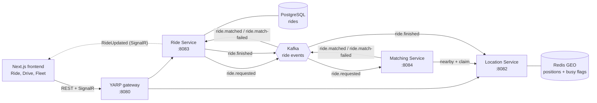
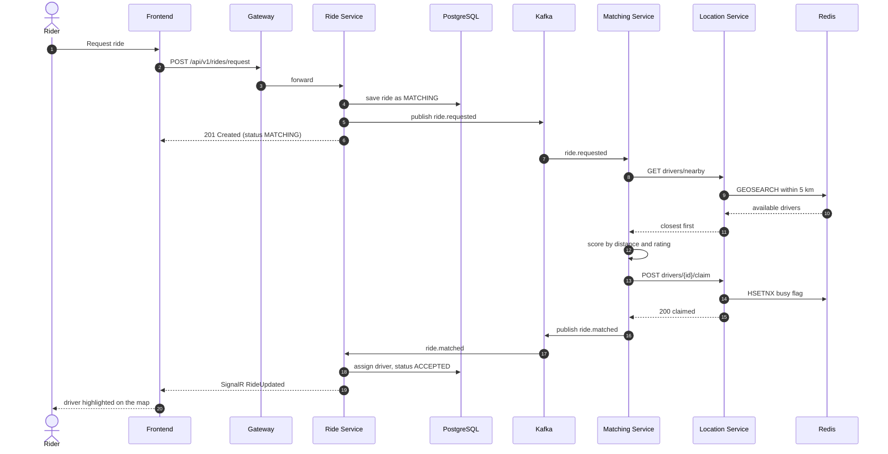
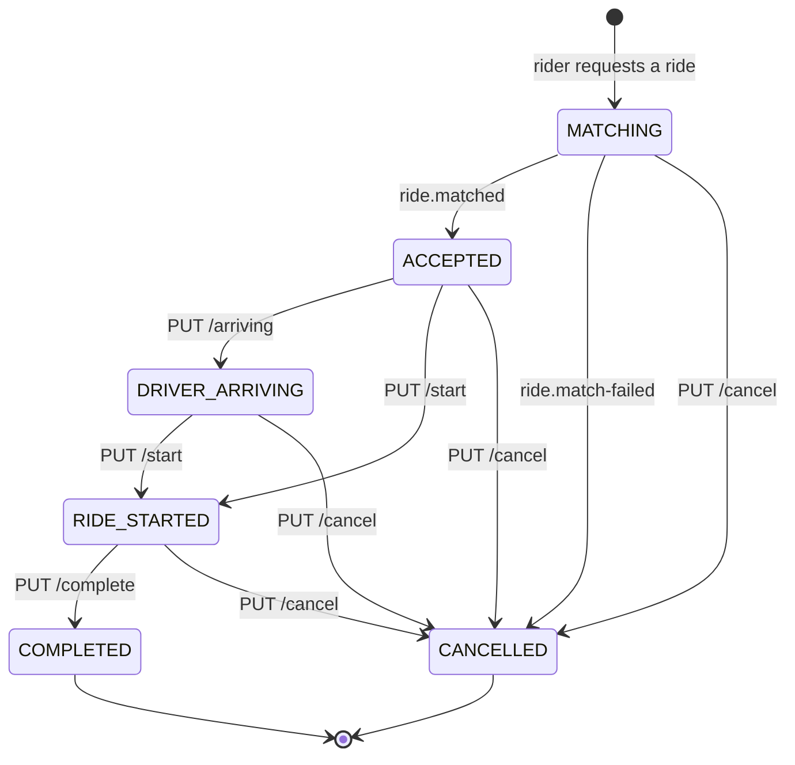
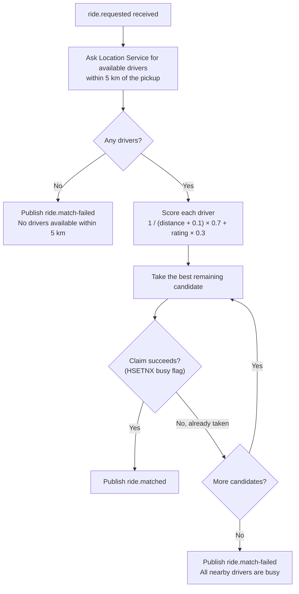
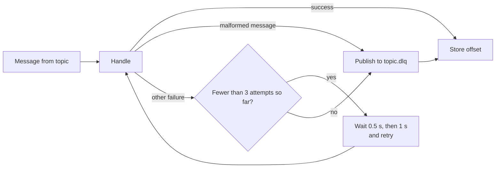
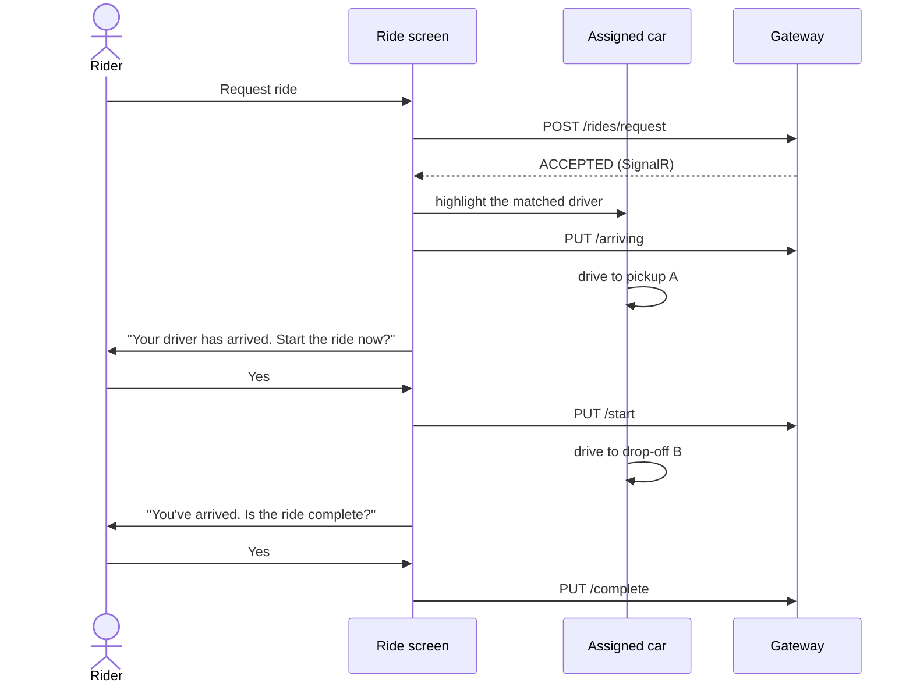
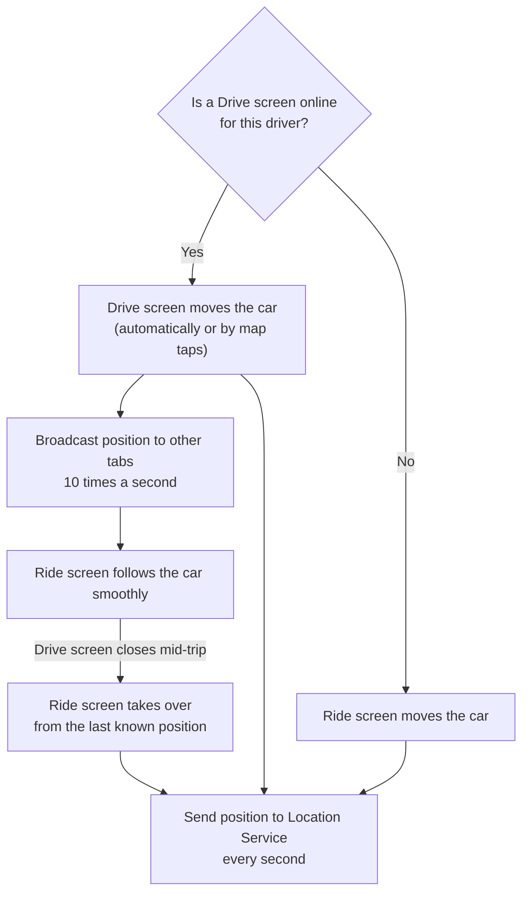
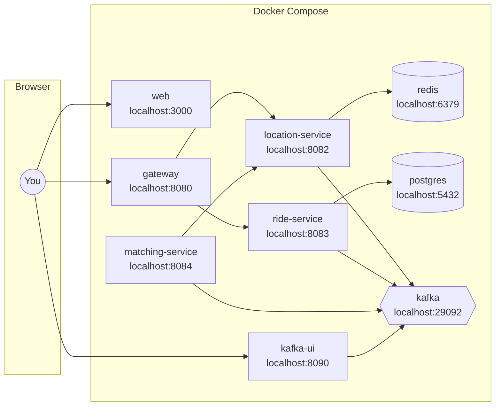
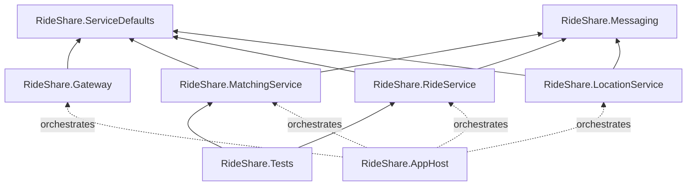

# RideShare

A ride-hailing platform built with **.NET 10**, **Aspire** and **Next.js**. Riders request trips,
a matching service picks the best nearby driver, and both sides follow the ride live on a map.

It is a C#/.NET port of the Spring Boot **Uber-App** ("How Uber works under the hood"), with a
dedicated Next.js + TypeScript frontend and a set of fixes to the original design.

## Contents

- [Services at a glance](#services-at-a-glance)
- [How it works](#how-it-works)
  - [Architecture](#architecture)
  - [Life of a ride request](#life-of-a-ride-request)
  - [Ride state machine](#ride-state-machine)
  - [How a driver is matched](#how-a-driver-is-matched)
  - [Reliable event handling](#reliable-event-handling)
  - [The frontend](#the-frontend)
- [Tech stack](#tech-stack)
- [Run locally](#run-locally)
- [Trying it](#trying-it)
- [API](#api)
- [Behaviour changes and fixes compared with the Java version](#behaviour-changes-and-fixes-compared-with-the-java-version)
- [Project layout](#project-layout)
- [Verification status](#verification-status)
- [Production notes](#production-notes)

## Services at a glance

| Service | Port | Responsibility | Java original |
|---|---|---|---|
| `RideShare.LocationService` | 8082 | Real-time driver locations in Redis GEO; atomic driver claim | location-service |
| `RideShare.RideService` | 8083 | Ride lifecycle in PostgreSQL, publishes/consumes Kafka events, SignalR hub | ride-service |
| `RideShare.MatchingService` | 8084 | Consumes ride requests, scores and claims the best driver | matching-service |
| `RideShare.Gateway` | 8080 | YARP reverse proxy: single entry point, CORS, rate limiting | *(new)* |
| `frontend/` | 3000 | Rider app, driver simulator, fleet map | *(new)* |
| `RideShare.AppHost` | n/a | Aspire orchestration + dashboard | docker-compose + `mvn spring-boot:run` |

## How it works

### Architecture

The browser only talks to the gateway. Services talk to each other through Kafka events, except
for the matching service, which calls the location service directly to find and reserve a driver.



### Life of a ride request

What happens between pressing *Request ride* and seeing a driver on the map:



When the ride is completed or cancelled, the Ride Service publishes `ride.finished`, and the
Location Service clears the driver's busy flag so they can be matched again.

### Ride state machine

Transitions live on the `Ride` aggregate, so an invalid move (for example cancelling a completed
ride) is rejected with `409 Conflict`.



The full status list is `REQUESTED → MATCHING → ACCEPTED → DRIVER_ARRIVING → RIDE_STARTED → COMPLETED`,
with `CANCELLED` reachable from any non-terminal state. A new ride is stored directly as `MATCHING`
(see [Status race fixed](#behaviour-changes-and-fixes-compared-with-the-java-version)).

### How a driver is matched

The matching service ranks nearby drivers and then tries to reserve them one by one, best first.
The reservation is atomic in Redis, so two rides can never get the same driver.



Ratings come from `IDriverRatingProvider`. The current implementation derives a stable rating
between 4.0 and 5.0 from the driver id, so rankings are deterministic.

### Reliable event handling

Every Kafka consumer stores its offset only after a message is handled. A message that keeps
failing is moved to a dead-letter topic instead of blocking the partition.



Topics are created on startup with 3 partitions each: `ride.requested`, `ride.matched`,
`ride.match-failed` and `ride.finished`, plus a `.dlq` dead-letter topic for each.

### The frontend

The Next.js app has three screens that all talk to the gateway:

| Screen | Route | What it does |
|---|---|---|
| **Ride** | `/` | Book a trip, watch the assigned driver drive to you, confirm the start and end of the ride |
| **Drive** | `/driver` | Act as a driver: go online, drive to the pickup and drop-off (automatically or by tapping the map) |
| **Fleet** | `/fleet` | See every driver and whether they are busy, add up to 10 drivers at random nearby spots or place them on the map |

#### A ride from the rider's point of view



Answering *No* closes the prompt and leaves a *Start ride* or *Complete ride* button in the panel.
While the car moves, its position is sent to the Location Service every second.

#### Keeping the Ride and Drive screens in sync

Exactly one screen moves a car at a time. Open tabs in the same browser share positions, driver
presence and ride updates over a `BroadcastChannel`, so the screens move in step without waiting
for polling. Other devices catch up through the Location Service and SignalR.



At each stop, the Ride screen asks the rider to confirm and the Drive screen shows
*Waiting for the rider*. A start, completion or cancellation on either screen updates the other
immediately. The shared logic lives in `frontend/src/lib/tripPlayback.ts`.

## Tech stack

### Backend

| Area | Technology |
|---|---|
| Language and runtime | C# (latest), .NET 10, ASP.NET Core Minimal APIs |
| API gateway | YARP 2.3 reverse proxy with service discovery, CORS and rate limiting |
| Real-time updates | ASP.NET Core SignalR (`/hubs/rides`) |
| Database | PostgreSQL 17 with Entity Framework Core 10 (Npgsql provider) |
| Driver locations | Redis 8 GEO commands via StackExchange.Redis |
| Messaging | Apache Kafka 4.0 (KRaft mode) via Confluent.Kafka |
| Resilience | `Microsoft.Extensions.Http.Resilience`, `Microsoft.Extensions.ServiceDiscovery` |
| Validation and errors | .NET 10 `AddValidation()`, RFC 9457 ProblemDetails |
| Observability | OpenTelemetry (traces, metrics, logs, OTLP exporter), `/health` and `/alive` endpoints |
| API docs | `Microsoft.AspNetCore.OpenApi` at `/openapi/v1.json` |
| Orchestration | Aspire 13.5 AppHost (Redis Insight, Kafka UI, pgAdmin) |
| Tests | xUnit 2.9 |

### Frontend

| Area | Technology |
|---|---|
| Framework | Next.js 16.3 (App Router), React 19.2, TypeScript 5.9 |
| Styling | Tailwind CSS 4.3 |
| Data fetching | TanStack Query 5 |
| Real-time updates | `@microsoft/signalr` 10, plus `BroadcastChannel` to keep open tabs in sync |
| Maps | Leaflet 1.9 with React Leaflet 5, CARTO basemap tiles |
| Linting | ESLint 9 (`eslint-config-next`) |

### Infrastructure

| Area | Technology |
|---|---|
| Containers | Docker, Docker Compose |
| Images | `mcr.microsoft.com/dotnet/sdk:10.0` and `aspnet:10.0`, `node:22-alpine`, `redis:8-alpine`, `postgres:17-alpine`, `apache/kafka:4.0.0`, `provectuslabs/kafka-ui` |

### Why PostgreSQL instead of MySQL

Pomelo, the MySQL EF Core provider that Aspire's MySQL EF integration wraps, has no stable
EF Core 10 release yet. PostgreSQL has first-class EF Core 10 and Aspire support. To switch
back once a provider is available:

1. `RideShare.RideService.csproj`: replace the Npgsql package with `Aspire.Pomelo.EntityFrameworkCore.MySql`.
2. `Program.cs`: `AddNpgsqlDbContext` → `AddMySqlDbContext`.
3. `AppHost.cs`: `AddPostgres(...)` → `AddMySql(...)`.
4. `RideDbContext`: the `uint Version` row version maps to PostgreSQL `xmin`; replace it with a regular concurrency token.

## Run locally

### With Docker Compose (simplest)

You only need [Docker Desktop](https://www.docker.com/products/docker-desktop/) running.

```bash
git clone https://github.com/Ridzzz0Alam/rideSharing.git
cd rideSharing
docker compose up --build -d
```

The first build takes a few minutes. Then open:

| What | URL |
|---|---|
| App | http://localhost:3000 |
| API gateway | http://localhost:8080 |
| Kafka UI | http://localhost:8090 |

To stop everything, run `docker compose down`. Add `-v` to also delete the database.

Compose starts the containers below. Each service waits for the infrastructure it depends on to
report healthy.



The browser calls the gateway directly, which is why the frontend container is configured with
`GATEWAY_URL=http://localhost:8080`.

### With Aspire (for development)

This option needs the .NET 10 SDK, Node.js 22+ and Docker. It runs the services from source
and opens the Aspire dashboard, with logs, traces, Redis Insight, Kafka UI and pgAdmin.

```bash
cd frontend && npm install && cd ..
dotnet run --project src/RideShare.AppHost
```

On Windows with Smart App Control or a similar application control policy turned on, the
locally built AppHost executable may be blocked. If it is, use Docker Compose instead.

## Trying it

In the UI:

1. **Fleet** → *Add a driver* a few times (up to 10). Each one appears at a random spot within 2.5 km of the sample pickup.
2. **Ride** → *Use the sample Bangalore trip* → *Request ride*. Within a second or two a
   driver is assigned and highlighted on the map.
3. The car drives to the pickup and you are asked whether to start the ride. Answer *Yes*,
   and the car drives to the drop-off, where you confirm that the ride is complete.
4. Optional: open **Drive** in a second window, enter the assigned driver's id and press
   *Go online*. That window then drives the car, and both screens stay in sync.

With HTTP requests: `http/rideshare.http` reproduces every step of the original README
through the gateway (VS Code REST Client, Rider or Visual Studio).

## API

All routes are also available on the gateway (port 8080).

### Location Service

| Method | Route | Notes |
|---|---|---|
| POST | `/api/v1/locations/drivers/update` | `{ driverId, latitude, longitude }` |
| GET | `/api/v1/locations/drivers/nearby?latitude=&longitude=&radius=5` | Available (not busy) drivers, closest first, max 10 |
| GET | `/api/v1/locations/drivers/` | **New.** All drivers with busy flag |
| DELETE | `/api/v1/locations/drivers/{driverId}` | Driver goes offline |
| POST | `/api/v1/locations/drivers/{driverId}/claim` | **New.** `{ rideId }` → 200, or 409 if busy |
| POST | `/api/v1/locations/drivers/{driverId}/release` | **New.** `{ rideId }` |

### Ride Service

| Method | Route | Notes |
|---|---|---|
| POST | `/api/v1/rides/request` | 201 + `Location` header |
| POST | `/api/v1/rides/estimate` | **New.** Fare and distance before booking |
| GET | `/api/v1/rides/{rideId}` | |
| GET | `/api/v1/rides/rider/{riderId}` | Newest first |
| GET | `/api/v1/rides/driver/{driverId}` | **New** |
| PUT | `/api/v1/rides/{rideId}/arriving` | **New.** Sets `DRIVER_ARRIVING` |
| PUT | `/api/v1/rides/{rideId}/start` | From `ACCEPTED` or `DRIVER_ARRIVING` |
| PUT | `/api/v1/rides/{rideId}/complete` | From `RIDE_STARTED` |
| PUT | `/api/v1/rides/{rideId}/cancel?reason=` | Any non-terminal state |
| WS | `/hubs/rides` | **New.** SignalR: `SubscribeToRide/Rider/Driver`, server sends `RideUpdated` |

### Kafka topics

Kafka topics (3 partitions each, created on startup): `ride.requested`, `ride.matched`,
`ride.match-failed`, `ride.finished`, plus a `.dlq` dead-letter topic for each.

| Topic | Published by | Consumed by | Meaning |
|---|---|---|---|
| `ride.requested` | Ride Service | Matching Service | A rider asked for a ride |
| `ride.matched` | Matching Service | Ride Service | A driver was claimed for the ride |
| `ride.match-failed` | Matching Service | Ride Service | No driver could be claimed; the ride is cancelled with a reason |
| `ride.finished` | Ride Service | Location Service | The ride completed or was cancelled; release the driver |

## Behaviour changes and fixes compared with the Java version

- **Status race fixed.** Java saved `REQUESTED`, published the event, then saved `MATCHING`. A fast match could land in between and be overwritten, leaving an assigned ride stuck in `MATCHING`. The ride is now persisted as `MATCHING` before publishing.
- **No more double-booked drivers.** Java could assign the same driver to several rides. The matcher now atomically claims a driver in Redis (`HSETNX`, idempotent per ride) and falls back to the next best candidate. Busy drivers are excluded from nearby search and freed via `ride.finished` when a ride completes or is cancelled.
- **Rides no longer hang when no driver is found.** Java only logged a warning. The matcher now publishes `ride.match-failed` and the ride becomes `CANCELLED` with a reason.
- **Deterministic scoring.** Java called `Math.random()` inside the comparator, so rankings changed on each comparison. Ratings are now a stable per-driver value behind `IDriverRatingProvider`, ready to be replaced by a real driver service. The scoring formula and 70/30 weights are unchanged.
- **Guarded state machine.** Transitions live on the `Ride` aggregate. You can no longer cancel a completed ride. `DRIVER_ARRIVING` is reachable, and duplicate Kafka events are ignored.
- **Proper HTTP status codes.** Not found is 404, an invalid transition is 409, a concurrent update is 409, and dispatch being unavailable is 503. Validation still returns 400, now as ProblemDetails. Required coordinates are really required (Java's `@NotNull` on a primitive `double` never fired).
- **Consistent responses.** `updatedAt` is now included in responses (Java's mapper skipped it). Enum values keep the Java wire format (`RIDE_STARTED`).
- **At-least-once consumers.** Offsets are stored after handling, with retries and a dead-letter topic. This replaces the "send to DLQ" TODO.
- **Locale-safe HTTP calls.** Query strings to the location service are built with the invariant culture, so coordinates don't break on locales that use a decimal comma (such as hu-HU).
- **No secrets in config.** The database password is no longer committed. Aspire generates it; compose uses local-only defaults.

## Project layout

```
RideShare.slnx
Directory.Build.props        shared settings and package versions
src/
  RideShare.AppHost/         Aspire orchestration
  RideShare.ServiceDefaults/ OpenTelemetry, health checks, service discovery, resilience
  RideShare.Messaging/       event contracts, Kafka publisher, consumer base, topic creation
  RideShare.LocationService/
  RideShare.RideService/     Domain/, Data/, Application/ (service + SignalR hub)
  RideShare.MatchingService/
  RideShare.Gateway/
tests/RideShare.Tests/       fare, state machine and scoring tests
frontend/                    Next.js app (see frontend/README.md)
  src/app/                   routes: Ride (/), Drive (/driver), Fleet (/fleet)
  src/components/            screens, map and UI building blocks
  src/lib/                   API client, SignalR provider, trip playback and tab sync
http/rideshare.http          manual end-to-end requests
docker-compose.yml, Dockerfile
```



## Verification status

- **Frontend:** type-checks, lints cleanly and builds with `next build`. The full rider → driver → complete flow was exercised in headless Chromium against a mock gateway at desktop and mobile sizes.
- **.NET solution:** written against the documented APIs and package versions, but not compiled in the environment where it was produced (no .NET SDK or NuGet access there). Run `dotnet build` and `dotnet test` first.
  Since then, all services have been built with `dotnet publish` in the Docker images and a full ride (drivers, request, match, start, complete) has run end to end through the gateway with Docker Compose. `dotnet test` has not been run yet.

The areas most likely to need a small adjustment are:
- the Aspire JavaScript hosting API (`AddNextJsApp` is marked experimental);
- the .NET 10 validation source-generator setup;
- exact patch versions in `Directory.Build.props`.

## Production notes

- Replace `EnsureCreated` with EF Core migrations (`dotnet ef migrations add Initial`).
- Use a transactional outbox for publishing `ride.requested` and `ride.finished` together with the database write.
- Add a Redis backplane for SignalR (`AddStackExchangeRedis`) when running more than one Ride Service instance.
- Add authentication. Currently rider and driver ids are trusted as given, as in the original.
- CARTO basemap tiles are fine for development; check their usage terms or self-host tiles for production.
