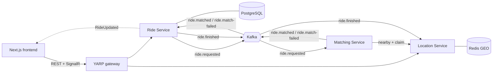

# RideShare (.NET 10 + Aspire + Next.js)

A C#/.NET port of the Spring Boot **Uber-App** ("How Uber works under the hood"),
with a dedicated Next.js + TypeScript frontend.

| Service | Port | Responsibility | Java original |
|---|---|---|---|
| `RideShare.LocationService` | 8082 | Real-time driver locations in Redis GEO; atomic driver claim | location-service |
| `RideShare.RideService` | 8083 | Ride lifecycle in PostgreSQL, publishes/consumes Kafka events, SignalR hub | ride-service |
| `RideShare.MatchingService` | 8084 | Consumes ride requests, scores and claims the best driver | matching-service |
| `RideShare.Gateway` | 8080 | YARP reverse proxy: single entry point, CORS, rate limiting | *(new)* |
| `frontend/` | 3000 | Rider app, driver simulator, fleet map | *(new)* |
| `RideShare.AppHost` | — | Aspire orchestration + dashboard | docker-compose + `mvn spring-boot:run` |

## Architecture



Ride state machine: `REQUESTED → MATCHING → ACCEPTED → DRIVER_ARRIVING → RIDE_STARTED → COMPLETED`,
with `CANCELLED` reachable from any non-terminal state.

## Tech stack

Versions were checked against Context7 and NuGet/npm in September 2026.

| Concern | Java version | This version |
|---|---|---|
| Runtime | Java / Spring Boot | .NET 10 (LTS), C# latest, ASP.NET Core Minimal APIs |
| Orchestration | docker-compose | Aspire 13.5 (`Aspire.AppHost.Sdk`), dashboard with logs/traces/metrics |
| Geo store | Spring Data Redis | StackExchange.Redis via `Aspire.StackExchange.Redis` (`GEOADD`, `GEOSEARCH`) |
| Messaging | Spring Kafka + Zookeeper | Confluent.Kafka via `Aspire.Confluent.Kafka`, Kafka in KRaft mode (no Zookeeper) |
| Database | JPA/Hibernate + MySQL | EF Core 10 + PostgreSQL via `Aspire.Npgsql.EntityFrameworkCore.PostgreSQL` |
| Service-to-service HTTP | OpenFeign | Typed `HttpClient` + service discovery + standard resilience handler |
| Validation / errors | Bean Validation + `@RestControllerAdvice` | .NET 10 built-in `AddValidation()` + RFC 9457 ProblemDetails |
| Observability | Actuator | OpenTelemetry + `/health`, `/alive` |
| API docs | — | `Microsoft.AspNetCore.OpenApi` at `/openapi/v1.json` |
| Frontend | — | Next.js 16.3, React 19.2, Tailwind 4, TanStack Query 5, SignalR 10, Leaflet |

### Why PostgreSQL instead of MySQL

Pomelo, the MySQL EF Core provider that Aspire's MySQL EF integration wraps, has no stable
EF Core 10 release yet. PostgreSQL has first-class EF Core 10 and Aspire support. To switch
back once a provider is available:

1. `RideShare.RideService.csproj`: replace the Npgsql package with `Aspire.Pomelo.EntityFrameworkCore.MySql`.
2. `Program.cs`: `AddNpgsqlDbContext` → `AddMySqlDbContext`.
3. `AppHost.cs`: `AddPostgres(...)` → `AddMySql(...)`.
4. `RideDbContext`: the `uint Version` row version maps to PostgreSQL `xmin`; replace it with a regular concurrency token.

## Running

### Option A: Aspire (recommended for development)

Prerequisites: .NET 10 SDK, Node.js 22+, Docker (or Podman), and optionally the Aspire CLI
(`dotnet tool install -g aspire.cli`, or see aspire.dev).

```bash
cd frontend && npm install && cd ..
aspire run            # or: dotnet run --project src/RideShare.AppHost
```

The Aspire dashboard opens automatically. From it you can open the frontend (`web`),
Kafka UI, RedisInsight and pgAdmin. Service ports match the Java version (8082/8083/8084),
and the gateway is on 8080.

### Option B: Docker Compose (no .NET SDK needed)

```bash
docker compose up --build
```

Frontend http://localhost:3000, gateway http://localhost:8080, Kafka UI http://localhost:8090.

### Option C: run things individually

Start Redis, Kafka and PostgreSQL yourself (for example the infrastructure part of
`docker-compose.yml`), then `dotnet run` each project under `src/`. `appsettings.json`
in each service points at `localhost` defaults. For Kafka from compose use
`ConnectionStrings__kafka=localhost:29092`.

## Trying it

In the UI:

1. **Fleet** → *Add a driver* a few times (up to 10). Each one appears at a random spot within 2.5 km of the sample pickup.
2. **Ride** → *Use the sample Bangalore trip* → *Request ride*. Within a second or two the
   status line moves to *Driver assigned*.
3. **Drive** → driver id `driver:1` → *Go online*. The car drives itself to the pickup;
   press *Start trip*, watch it drive to the drop-off, then *Complete trip*.
   The Ride screen follows along live, and the driver is freed on the Fleet screen.

With HTTP requests: `http/rideshare.http` reproduces every step of the original README
through the gateway (VS Code REST Client, Rider or Visual Studio).

## API

All routes are also available on the gateway (port 8080).

| Method | Route | Notes |
|---|---|---|
| POST | `/api/v1/locations/drivers/update` | `{ driverId, latitude, longitude }` |
| GET | `/api/v1/locations/drivers/nearby?latitude=&longitude=&radius=5` | Available (not busy) drivers, closest first, max 10 |
| GET | `/api/v1/locations/drivers/` | **New.** All drivers with busy flag |
| DELETE | `/api/v1/locations/drivers/{driverId}` | Driver goes offline |
| POST | `/api/v1/locations/drivers/{driverId}/claim` | **New.** `{ rideId }` → 200, or 409 if busy |
| POST | `/api/v1/locations/drivers/{driverId}/release` | **New.** `{ rideId }` |
| POST | `/api/v1/rides/request` | 201 + `Location` header |
| POST | `/api/v1/rides/estimate` | **New.** Fare and distance before booking |
| GET | `/api/v1/rides/{rideId}` | |
| GET | `/api/v1/rides/rider/{riderId}` | Newest first |
| GET | `/api/v1/rides/driver/{driverId}` | **New** |
| PUT | `/api/v1/rides/{rideId}/arriving` | **New.** Sets `DRIVER_ARRIVING` |
| PUT | `/api/v1/rides/{rideId}/start` | From `ACCEPTED` or `DRIVER_ARRIVING` |
| PUT | `/api/v1/rides/{rideId}/complete` | From `RIDE_STARTED` |
| PUT | `/api/v1/rides/{rideId}/cancel?reason=` | Any non-terminal state |
| WS | `/hubs/rides` | **New.** SignalR: `SubscribeToRide/Rider/Driver`, server sends `RideUpdated` |

Kafka topics (3 partitions each, created on startup): `ride.requested`, `ride.matched`,
`ride.match-failed`, `ride.finished`, plus a `.dlq` dead-letter topic for each.

## Behaviour changes and fixes compared with the Java version

- **Status race fixed.** Java saved `REQUESTED`, published the event, then saved `MATCHING`. A fast match could land in between and be overwritten, leaving an assigned ride stuck in `MATCHING`. The ride is now persisted as `MATCHING` before publishing.
- **No more double-booked drivers.** Java could assign the same driver to several rides. The matcher now atomically claims a driver in Redis (`HSETNX`, idempotent per ride) and falls back to the next best candidate. Busy drivers are excluded from nearby search and freed via `ride.finished` when a ride completes or is cancelled.
- **Rides no longer hang when no driver is found.** Java only logged a warning. The matcher now publishes `ride.match-failed` and the ride becomes `CANCELLED` with a reason.
- **Deterministic scoring.** Java called `Math.random()` inside the comparator, so rankings changed on each comparison. Ratings are now a stable per-driver value behind `IDriverRatingProvider`, ready to be replaced by a real driver service. The scoring formula and 70/30 weights are unchanged.
- **Guarded state machine.** Transitions live on the `Ride` aggregate. You can no longer cancel a completed ride. `DRIVER_ARRIVING` is reachable, and duplicate Kafka events are ignored.
- **Proper HTTP status codes.** Not found is 404, an invalid transition is 409, a concurrent update is 409, and dispatch being unavailable is 503. Validation still returns 400, now as ProblemDetails. Required coordinates are really required (Java's `@NotNull` on a primitive `double` never fired).
- **Consistent responses.** `updatedAt` is now included in responses (Java's mapper skipped it). Enum values keep the Java wire format (`RIDE_STARTED`).
- **At-least-once consumers.** Offsets are stored after handling, with retries and a dead-letter topic. This replaces the "send to DLQ" TODO.
- **Locale-safe HTTP calls.** Query strings to the location service are built with the invariant culture, so coordinates don't break on locales that use a decimal comma (such as hu-HU).
- **No secrets in config.** The database password is no longer committed. Aspire generates it; compose uses local-only defaults.

## Project layout

```
RideShare.slnx
Directory.Build.props        shared settings and package versions
src/
  RideShare.AppHost/         Aspire orchestration
  RideShare.ServiceDefaults/ OpenTelemetry, health checks, service discovery, resilience
  RideShare.Messaging/       event contracts, Kafka publisher, consumer base, topic creation
  RideShare.LocationService/
  RideShare.RideService/     Domain/, Data/, Application/ (service + SignalR hub)
  RideShare.MatchingService/
  RideShare.Gateway/
tests/RideShare.Tests/       fare, state machine and scoring tests
frontend/                    Next.js app (see frontend/README.md)
http/rideshare.http          manual end-to-end requests
docker-compose.yml, Dockerfile
```

## Verification status

- **Frontend:** type-checks, lints cleanly and builds with `next build`. The full rider → driver → complete flow was exercised in headless Chromium against a mock gateway at desktop and mobile sizes.
- **.NET solution:** written against the documented APIs and package versions, but not compiled in the environment where it was produced (no .NET SDK or NuGet access there). Run `dotnet build` and `dotnet test` first.

The areas most likely to need a small adjustment are:
- the Aspire JavaScript hosting API (`AddNextJsApp` is marked experimental);
- the .NET 10 validation source-generator setup;
- exact patch versions in `Directory.Build.props`.

## Production notes

- Replace `EnsureCreated` with EF Core migrations (`dotnet ef migrations add Initial`).
- Use a transactional outbox for publishing `ride.requested` and `ride.finished` together with the database write.
- Add a Redis backplane for SignalR (`AddStackExchangeRedis`) when running more than one Ride Service instance.
- Add authentication. Currently rider and driver ids are trusted as given, as in the original.
- CARTO basemap tiles are fine for development; check their usage terms or self-host tiles for production.
